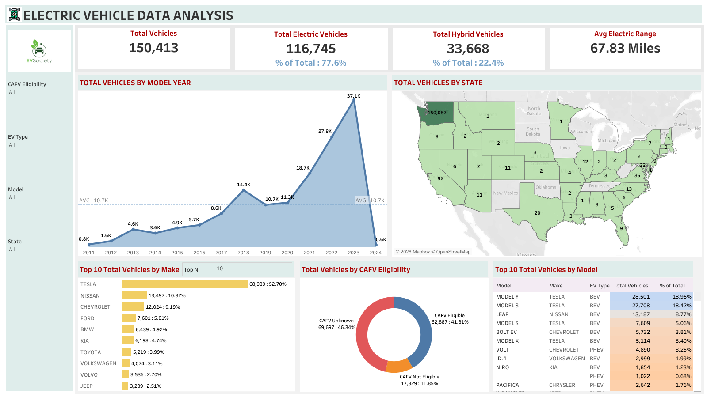

# Electric Vehicle Data Analysis Dashboard

## Project Overview
This project analyzes Electric Vehicle (EV) adoption trends using Tableau.  
It provides insights into growth patterns, manufacturer dominance, and geographic distribution.

## Live Dashboard
Click below to view the interactive dashboard:  
https://public.tableau.com/app/profile/harshil.patel1403/viz/ElectricVehicleDataAnalysis_17743671212720/Dashboard1?publish=yes

## Dashboard Preview

## Key Insights
- Rapid increase in EV adoption after 2018  
- Tesla dominates the EV market  
- High adoption in states like California and Washington  
- CAFV eligibility impacts EV growth  

## Tools Used
- Tableau Public  
- Data Visualization  
- CSV Dataset  

## Project Files
- `ElectricVehicleDataAnalysis.twbx` → Tableau dashboard  
- `images/` → Dashboard preview image  

## Author
Harshil Patel  
Master’s Student – Data Science / Information Systems  
